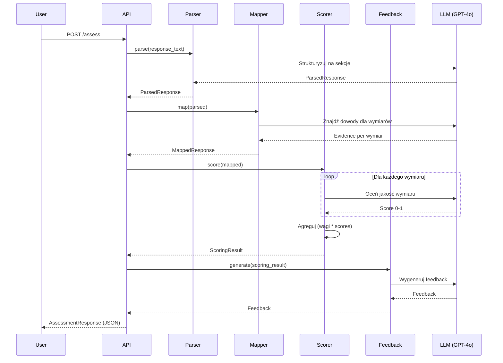
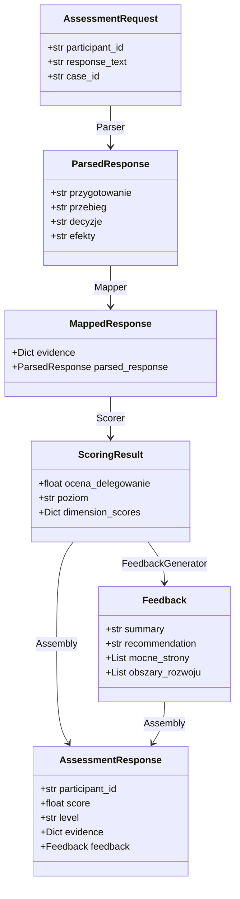

# Architektura Systemu Oceny LEM

Szczegółowy opis architektury technicznej systemu.

## Przegląd wysokopoziomowy

```
┌─────────────────┐
│   Uczestnik     │
│   (odpowiedź)   │
└────────┬────────┘
         │
         ▼
┌─────────────────────────────────────────────────────────┐
│                     FastAPI Server                      │
│                    (app/main.py)                        │
└────────┬────────────────────────────────────────────────┘
         │
         ▼
┌─────────────────────────────────────────────────────────┐
│                  Pipeline Processing                     │
│                                                          │
│  ┌──────────┐  ┌──────────┐  ┌──────────┐  ┌──────────┐│
│  │ Parser   │→ │ Mapper   │→ │ Scorer   │→ │ Feedback ││
│  │ (Moduł 1)│  │ (Moduł 2)│  │ (Moduł 3)│  │ (Moduł 4)││
│  └──────────┘  └──────────┘  └──────────┘  └──────────┘│
│       ↓             ↓             ↓             ↓        │
│  Structured    Evidence      Scoring      Personalized  │
│  Sections      Extraction    Algorithm    Feedback      │
└─────────────────────────────────────────────────────────┘
         │
         ▼
┌─────────────────┐
│  JSON Response  │
│  (ocena +       │
│   feedback)     │
└─────────────────┘
```

## Moduły systemu

### Moduł 1: Parser (`app/modules/parser.py`)

**Odpowiedzialność**: Strukturyzacja narracyjnej odpowiedzi na logiczne sekcje.

**Input**:
- Surowy tekst odpowiedzi uczestnika (string)

**Output**:
- `ParsedResponse` z 4 sekcjami:
  - przygotowanie
  - przebieg
  - decyzje
  - efekty

**Technologia**:
- OpenAI GPT-4o (temperatura: 0.1)
- Prompt engineering (`app/prompts/parse_prompt.txt`)
- JSON mode dla strukturyzowanego outputu

**Walidacja**:
- Każda sekcja min. 20-30 znaków
- Wszystkie 4 sekcje wypełnione

---

### Moduł 2: Mapper (`app/modules/mapper.py`)

**Odpowiedzialność**: Ekstrakcja cytatów-dowodów dla 7 wymiarów delegowania.

**Input**:
- `ParsedResponse` (strukturyzowane sekcje)

**Output**:
- `MappedResponse` z `WymiarEvidence` dla każdego z 7 wymiarów:
  - intencja
  - stan_docelowy
  - metoda_pomiaru
  - poziom_odpowiedzialnosci
  - harmonogram
  - monitorowanie
  - sprawdzenie_zrozumienia

**Dla każdego wymiaru**:
- `znalezione_fragmenty`: max 2 cytaty (dosłowne)
- `czy_obecny`: boolean
- `notatki`: krótkie uzasadnienie

**Technologia**:
- OpenAI GPT-4o (temperatura: 0.1)
- Prompt z definicjami wymiarów z rubryki
- JSON mode

---

### Moduł 3: Scorer (`app/modules/scorer.py`)

**Odpowiedzialność**: Przypisanie oceny 0-4 (co 0.25) na podstawie wymiarów.

**Input**:
- `MappedResponse` (dowody dla wymiarów)

**Output**:
- `ScoringResult`:
  - `ocena_delegowanie`: float (0-4, zaokrąglone do 0.25)
  - `poziom`: string (Nieefektywny/Bazowy/Efektywny/Biegły)
  - `dimension_scores`: Dict[wymiar, DimensionScore]

**Algorytm**:

1. **Dla każdego wymiaru**:
   - Jeśli brak dowodów → ocena = 0.0
   - Jeśli są dowody → LLM ocenia jakość (0-1) na podstawie rubryki
   
2. **Agregacja**:
   ```python
   final_score = sum(wymiar_score * waga) * 4.0
   final_score = round(final_score * 4) / 4  # Zaokrąglenie do 0.25
   final_score = max(0.0, min(4.0, final_score))  # Clamp do 0-4
   ```

3. **Wagi wymiarów** (z `config/weights.json`):
   - stan_docelowy: 20%
   - poziom_odpowiedzialnosci: 20%
   - metoda_pomiaru: 15%
   - sprawdzenie_zrozumienia: 15%
   - intencja: 10%
   - harmonogram: 10%
   - monitorowanie: 10%
   - **SUMA: 100%**

**Technologia**:
- OpenAI GPT-4o dla oceny jakości wymiarów
- Deterministyczny algorytm agregacji
- Fallback heurystyka (jeśli LLM zawiedzie)

---

### Moduł 4: Feedback Generator (`app/modules/feedback.py`)

**Odpowiedzialność**: Generowanie spersonalizowanego feedbacku rozwojowego.

**Input**:
- `ScoringResult` (ocena + breakdown wymiarów + dowody)

**Output**:
- `Feedback`:
  - `summary`: 2-3 zdania (max 150 słów)
  - `recommendation`: 1-2 zdania (max 50 słów)
  - `mocne_strony`: lista 2-4 punktów
  - `obszary_rozwoju`: lista 2-4 punktów

**Strategia generowania**:
- Temperatura: 0.7 (wyższa dla wariantowości językowej)
- Prompt z cytatami-dowodami
- Instrukcje unikania powtarzalnych fraz
- Walidacja długości outputu

**Technologia**:
- OpenAI GPT-4o (temperatura: 0.7)
- Prompt engineering dla wariantowości
- JSON mode

---

## Przepływ danych

### 1. Request → API

```python
POST /assess
{
  "participant_id": "P001",
  "response_text": "Przygotowując się...",
  "case_id": "delegowanie_bnp_v1"
}
```

### 2. Walidacja Pydantic

```python
class AssessmentRequest(BaseModel):
    participant_id: str
    response_text: str = Field(min_length=50)
    case_id: str = "delegowanie_bnp_v1"
```

### 3. Pipeline Processing

```python
# Moduł 1
parsed = await parser.parse(request.response_text)

# Moduł 2
mapped = await mapper.map(parsed)

# Moduł 3
scoring_result = await scorer.score(mapped)

# Moduł 4
feedback = await feedback_generator.generate(scoring_result)
```

### 4. Response Assembly

```python
response = AssessmentResponse(
    participant_id=request.participant_id,
    score=scoring_result.ocena_delegowanie,
    level=scoring_result.poziom,
    evidence={...},  # Cytaty
    feedback=feedback,
    dimension_scores={...},  # Oceny wymiarów
    scoring_details=scoring_result  # Pełne dane (opcjonalne)
)
```

### 5. JSON Response

```json
{
  "participant_id": "P001",
  "timestamp": "2026-02-22T10:30:00Z",
  "score": 2.75,
  "level": "Efektywny",
  "evidence": {...},
  "feedback": {...},
  "dimension_scores": {...}
}
```

---

## Kluczowe decyzje architektoniczne

### 1. Modularność

**Decyzja**: 4 niezależne moduły (Parser, Mapper, Scorer, Feedback)

**Uzasadnienie**:
- Każdy moduł ma jedną odpowiedzialność (SRP)
- Łatwe testowanie jednostkowe
- Możliwość wymiany implementacji (np. inny LLM)
- Łatwe debugowanie (można zatrzymać się po każdym module)

### 2. Pydantic Models

**Decyzja**: Wszystkie struktury danych jako Pydantic models

**Uzasadnienie**:
- Automatyczna walidacja
- Type safety
- Automatyczna serializacja JSON
- Dokumentacja OpenAPI (Swagger)

### 3. Async/Await

**Decyzja**: Asynchroniczne wywołania LLM

**Uzasadnienie**:
- Lepsze wykorzystanie zasobów
- Możliwość równoległego przetwarzania
- Skalowalność (wiele requestów jednocześnie)

### 4. Separacja promptów

**Decyzja**: Prompty w osobnych plikach `.txt`

**Uzasadnienie**:
- Łatwa edycja bez zmiany kodu
- Wersjonowanie promptów
- Możliwość A/B testingu promptów

### 5. Wagi w JSON

**Decyzja**: Wagi wymiarów w `config/weights.json`

**Uzasadnienie**:
- Łatwa kalibracja bez zmiany kodu
- Wersjonowanie wag
- Możliwość hot-reload (przyszłość)

### 6. LLM dla oceny wymiarów

**Decyzja**: Użycie LLM do oceny jakości wymiarów (nie tylko regułki)

**Uzasadnienie**:
- Analiza semantyczna (nie tylko keyword matching)
- Rozumienie kontekstu
- Elastyczność (różne style odpowiedzi)
- Fallback heurystyka dla stabilności

---

## Skalowalność

### Obecna architektura (MVP)

- **Throughput**: ~10-20 ocen/minutę (zależnie od API OpenAI)
- **Latencja**: 20-40 sekund/ocena
- **Koszty**: ~$0.10-0.20/ocena (GPT-4o)

### Optymalizacje przyszłe

1. **Batch processing**:
   - Przetwarzanie wielu odpowiedzi równolegle
   - Cel: 100+ ocen/minutę

2. **Caching**:
   - Cache dla powtarzalnych fragmentów
   - Redukcja kosztów o 30-50%

3. **Model fine-tuning**:
   - Fine-tune GPT-4o na danych kalibracyjnych
   - Lepsza jakość + niższe koszty

4. **Hybrid approach**:
   - Regułki dla prostych przypadków
   - LLM tylko dla trudnych przypadków
   - Redukcja kosztów o 60-70%

---

## Bezpieczeństwo i compliance

### Dane osobowe

- System **nie przechowuje** odpowiedzi uczestników
- Wszystkie dane przetwarzane in-memory
- Opcjonalne logowanie do audytu (wyłączone domyślnie)

### API Security

- CORS middleware (konfigurowalny)
- Rate limiting (do dodania w produkcji)
- API key authentication (do dodania w produkcji)

### Audytowalność

- Każda ocena zawiera:
  - Timestamp
  - Participant ID
  - Pełny breakdown wymiarów
  - Cytaty-dowody
  - Wagi użyte
- Możliwość odtworzenia oceny

---

## Monitoring i debugging

### Logi

```python
# TODO: Dodać structured logging
import logging

logger = logging.getLogger("lem_assessment")
logger.info(f"Processing assessment for {participant_id}")
```

### Metryki

```python
# TODO: Dodać metryki Prometheus
from prometheus_client import Counter, Histogram

assessments_total = Counter('assessments_total', 'Total assessments')
assessment_duration = Histogram('assessment_duration_seconds', 'Assessment duration')
```

### Health checks

```python
GET /health
→ {"status": "healthy", "version": "1.0.0"}
```

---

## Rozszerzenie na 4 kompetencje

### Obecna architektura (1 kompetencja)

```
app/
├── rubric.py              # Tylko Delegowanie
├── modules/
│   ├── parser.py          # Specyficzny dla Delegowanie
│   ├── mapper.py          # 7 wymiarów Delegowanie
│   ├── scorer.py          # Wagi Delegowanie
│   └── feedback.py        # Feedback Delegowanie
```

### Przyszła architektura (4 kompetencje)

```
app/
├── rubrics/
│   ├── delegowanie.py
│   ├── podejmowanie_decyzji.py
│   ├── okreslanie_celow.py
│   └── informacja_zwrotna.py
├── modules/
│   ├── parser.py          # Uniwersalny
│   ├── mapper.py          # Uniwersalny (wymiary z rubryki)
│   ├── scorer.py          # Uniwersalny (wagi z config)
│   └── feedback.py        # Uniwersalny
```

**Zmiana**: ~40% dodatkowej pracy (głównie rubryki + prompty)

---

## Technologie

| Warstwa | Technologia | Wersja |
|---------|-------------|--------|
| Backend | FastAPI | 0.115.0 |
| Runtime | Python | 3.11+ |
| LLM | OpenAI GPT-4o | latest |
| Validation | Pydantic | 2.9.2 |
| Testing | pytest | 8.3.3 |
| HTTP Client | httpx | 0.27.2 |

---

## Diagramy

### Diagram sekwencji



### Diagram klas (uproszczony)


